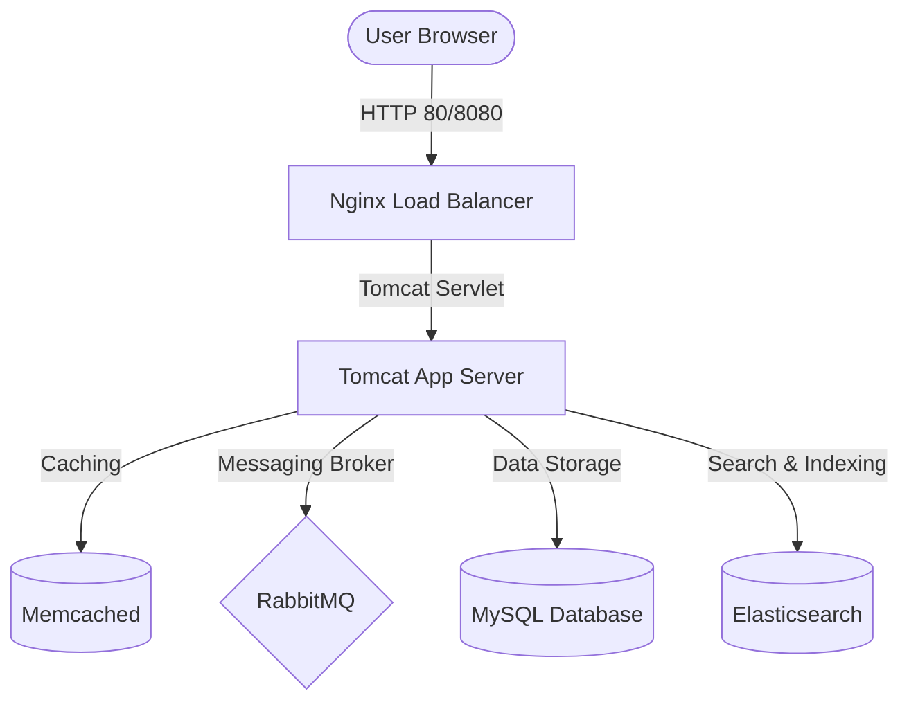

# VProfile DevOps Multi-Pipeline Project (CI/CD & Local VM Provisioning)
 
Welcome to the **VProfile DevOps Project** repository. This project showcases the configuration, packaging, testing, and deployment pipeline variations for a multi-tier Java Spring MVC web application using modern DevOps practices. 

This repository contains **three distinct versions** of the project, tailored for different environments and pipeline requirements:
1. **`vprofile-project-aws-ci`**: Local VM Provisioning (Vagrant) + Continuous Integration (CI) baseline.
2. **`vprofile-project-ci-aws`**: Clean Continuous Integration (CI) configuration targeting AWS (using CodeArtifact).
3. **`vprofile-project-cd-aws`**: Continuous Delivery & Deployment (CD) pipeline targeting AWS, featuring production-ready error-handling views, localhost overrides, and automated release scripts.

---

## 🏗️ Multi-Tier Architecture Overview

The VProfile application is a Java Spring-based web application requiring several backing services to function:



* **Frontend / Load Balancer**: Nginx
* **Application Tier**: Tomcat (Spring MVC Application)
* **Caching Tier**: Memcached (User session & query caching)
* **Message Broker**: RabbitMQ (Asynchronous message processing)
* **Database Tier**: MySQL (Persistent application store)
* **Search Tier**: Elasticsearch (User & data indexing)

---

## 📁 Repository Directory Structure

```
compare/
├── vprofile-project-aws-ci/     # Local VM testing (Vagrant) & basic CI setup
├── vprofile-project-ci-aws/     # AWS-ready CI version with AWS CodeArtifact integration
└── vprofile-project-cd-aws/     # AWS CD version with custom application configs & release pipelines
```

### Key Differences Between the Environments

| Feature | `vprofile-project-aws-ci` | `vprofile-project-ci-aws` | `vprofile-project-cd-aws` |
| :--- | :---: | :---: | :---: |
| **Vagrant VMs** | ✅ Included | ❌ Excluded | ❌ Excluded |
| **Artifact Store** | Sonatype Nexus | AWS CodeArtifact | Sonatype Nexus (Release Group) |
| **Ansible Playbooks** | ✅ Included | ✅ Included | ✅ Included |
| **Error Handling / JSP Views** | Standard | Standard | ✅ Custom error views & Handlers |
| **Database Driver** | `com.mysql.cj.jdbc.Driver` | `com.mysql.jdbc.Driver` | `com.mysql.cj.jdbc.Driver` |
| **Build Configurations** | `buildspec.yml` | `build_buildspec.yml` | `buildAndRelease_buildspec.yml`, `win_buildspec.yml` |

---

## 🛠️ Getting Started & Setup Guides

### 1. Local Development / VM Provisioning (`vprofile-project-aws-ci`)
This version is designed to deploy the full stack on local VirtualBox VMs orchestrated by Vagrant.

#### Prerequisites
* [Vagrant](https://www.vagrantup.com/)
* [VirtualBox](https://www.virtualbox.org/)
* JDK 17 & Maven 3.9

#### Steps
1. Navigate to the Vagrant directory:
   ```bash
   cd vprofile-project-aws-ci/vprofile-project-aws-ci/vagrant/Automated_provisioning_WinMacIntel
   ```
2. Provision and start the virtual machines:
   ```bash
   vagrant up
   ```
   *This command automatically spins up and configures VMs for Nginx, Tomcat, RabbitMQ, Memcached, MySQL, and Elasticsearch.*

---

### 2. Continuous Integration Pipeline (`vprofile-project-ci-aws`)
This version is optimized for AWS-native CI pipelines, integrating with AWS CodeBuild, AWS CodePipeline, and AWS CodeArtifact.

#### Pipeline Features
* **CodeArtifact Integration**: The `pom.xml` contains custom repository targets to fetch and store project dependencies inside AWS CodeArtifact.
* **SonarQube Scanner**: Includes `sonar_buildspec.yml` to trigger code quality analysis during the build phase.

#### Build Command
```bash
cd vprofile-project-ci-aws/vprofile-project-ci-aws
mvn clean install
```

---

### 3. Continuous Delivery Pipeline (`vprofile-project-cd-aws`)
This version is prepared for deployment (CD) on AWS ECS/EC2 instances. 

#### Key Enhancements
* **Production Configurations**: `application.properties` is configured to map backing service entrypoints to production-ready hosts.
* **Robust Error Handling**: Added custom page controllers and templates (`404.jsp`, `500.jsp`, `database-error.jsp`, `rabbitmq-error.jsp`) to prevent standard stack trace exposures to end-users.
* **CD Buildspecs**:
  * `buildAndStore_buildspec.yml`: Builds and packages artifacts into target AWS S3 deployment buckets.
  * `buildAndRelease_buildspec.yml`: Packages, releases, and notifies webhook endpoints.

---

## ⚙️ Key Configuration Details

### Database Initialization
MySQL requires database structure initialization using the SQL dump files provided:
* For **Local VM Testing**: Import `db_backup.sql`.
* For **AWS CI/CD Testing**: Import `accountsdb.sql` found under `src/main/resources/`.

```bash
mysql -u <user_name> -p accounts < src/main/resources/db_backup.sql
```

### Ansible Deployment
All three versions include pre-configured Ansible playbooks for automated server setup (`tomcat_setup.yml`, `vpro-app-setup.yml`). Execute them against your deployment inventory:
```bash
ansible-playplaybook -i inventory site.yml
```
